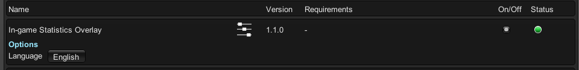
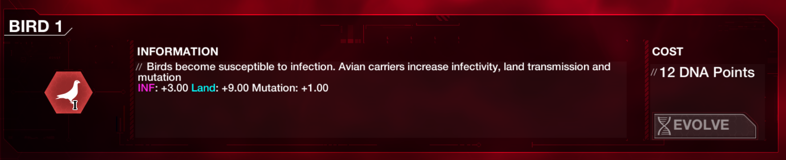
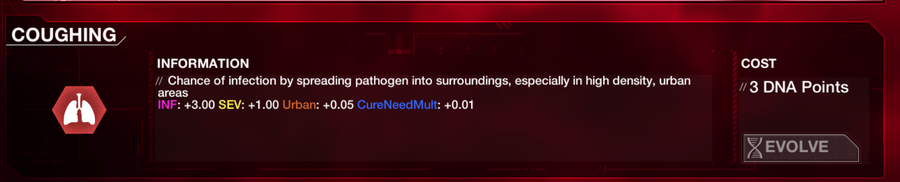

# In-game statistics overlay for Plague Inc: Evolved

This [UnityModManager](https://www.nexusmods.com/site/mods/21)-based mod provides useful statistics data for traits (technologies) and disease parameters (like cure speed and mutation counters) in-game. It will help you monitor game progress and check trait effects without external Wiki or jumping to scenario creator.

It is a quality-of-life (QoL) mod without gameplay changes.

## Features

- Internationalization support (currently English and Simplified Chinese, which can be set in UMM internal setting page)
- Useful data like INF/SEV/LET, cure effect, transmission rates after trait descriptions
- Global disease statistics on screen edge
- More precise cure progress (round up to two decimal places)

## Screenshots

### Setting page



### Trait description modification




### Disease data & Cure progress


## Explanations to some statistics

To shrink too long labels, some statistics in English use abbreviations to represent theirselves. Here are the full meanings:

| **Abbr in game** | **Full meaning** |
| :-: | :-: |
| INF | Infectivity |
| SEV | Severity |
| LET | Lethality |
| CureNeedMult | Cure requirement multiplier |
| CureSpdMult | **Opposite** of research inefficiency multiplier |
| CureNeed | Total cure requirement <br /> *(base value 2.5E+7)* |
| CureSpd | Effective cure research <br /> *(research inefficiency considered)* |
| MutCnt | Mutation triggering progress |
| MutTrig | Needed mutation progress to be triggered |

Other languages like Chinese are not affected.

## Installation

This mod only requires Unity Mod Manager (UMM).

1. Head to UMM download page previously mentioned.
2. Follow the instructions to install UMM for Plague Inc: Evolved.
3. Download the mod from [Releases](https://github.com/LittleYe233/PIStatsOverlay/releases) then choose one of the approaches to install the mod:
   - (auto) follow the instructions from UMM home page to drag and drop the mod into UMM window;
   - (manual) unzip the **contents** mod archive into `\Path\To\PlagueInc\Mods\PIStatsOverlay` where `\Path\To\PlagueInc` refers to the installation directory of this game (you can browse local files in Steam to get this folder).

If the installation is successful, you will see this mod in UMM in-game window when starting the game.

## Building

This repo is a .NET framework 4.8 class library project using Visual Studio 2022. It follows the project creation instructions on [UMM wiki](https://github.com/newman55/unity-mod-manager/wiki/How-to-create-a-mod-for-unity-game) with some modifications for my development environment. To build on your machine successfully, you may need to adjust the "build events".

Current post-build commands are:

```
start XCOPY /Y /R "$(TargetPath)" "D:\SteamLibrary\steamapps\common\PlagueInc\Mods\$(ProjectName)"
start XCOPY /Y /R "$(ProjectDir)$(OutDir)I18N.DotNet.dll" "D:\SteamLibrary\steamapps\common\PlagueInc\Mods\$(ProjectName)"
start XCOPY /Y /R "$(ProjectDir)Statics\Info.json" "D:\SteamLibrary\steamapps\common\PlagueInc\Mods\$(ProjectName)"
PowerShell "$(ProjectDir)Scripts\package.ps1" -configuration "$(Configuration)"
```

First three lines copy the built mod files to my local game, so if the game installation path is different on your machine, you should change it. However, it won't affect the built artifacts so you can still manually copy them later.

## To-do list

- Potential performance improvement.
- Score calculation for outbreak mode.
- Other statistics like world events, cure research budget, etc.

## Credits

- [Unity Mod Manager](https://www.nexusmods.com/site/mods/21) by newman55
- [plaguechanges](https://github.com/sschr15/plaguechanges) by sschr15 for some critical hints to correct classes to be patched
